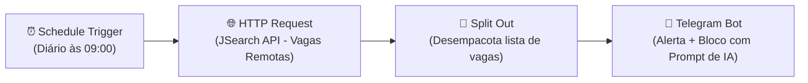

# 🚀 LinkedIn & Web Job Monitor com n8n

Automação inteligente e escalável construída no **n8n** para monitorar oportunidades de **estágio remoto em desenvolvimento de software** em tempo real e enviar alertas instantâneos diretamente no **Telegram**, com caixas de texto com recurso *one-click copy* para análise via IA.

---

## 📌 Arquitetura do Fluxo



---

## ✨ Funcionalidades Principais

- ⏱️ **Monitoramento Agendado:** Execução automática periódica sem necessidade de intervenção manual.
- 🎯 **Filtro Específico:** Busca direcionada para vagas de estágio remoto em TI/Desenvolvimento de software no Brasil.
- 💬 **Notificação Estruturada:** Envio de alertas no Telegram com cargo, empresa, modalidade e link direto de candidatura.
- 📋 **Prompt Pronto para IA (One-Click Copy):** Bloco de código formatado para copiar a descrição e requisitos com um único clique e enviar para o modelo de IA analisar seu perfil.

---

## 🛠️ Tecnologias Utilizadas

- **[n8n](https://n8n.io/)**: Orquestrador de fluxos e automações low-code
- **RapidAPI (JSearch API)**: Agregador de dados de vagas em tempo real (LinkedIn, Indeed, Glassdoor)
- **Telegram Bot API**: Entrega de notificações push no celular e desktop
- **Docker & Docker Compose**: Gerenciamento de containers e ambiente local reproduzível

---

## ⚙️ Como Executar o Projeto

### 1. Clonar o repositório
```bash
git clone https://github.com/Jntgirardi/n8n-linkedin-monitor.git
cd n8n-linkedin-monitor
```

### 2. Subir o n8n
Via Docker Compose:
```bash
docker compose up -d
```
Ou diretamente com Node.js:
```bash
npx n8n
```
Acesse o painel em: `http://localhost:5678`

### 3. Importar o Fluxo
1. No menu do n8n, clique em **Add Workflow** > **Import from File...**
2. Selecione o arquivo [`workflows/linkedin_job_monitor.json`](./workflows/linkedin_job_monitor.json).
3. Configure suas credenciais:
   - **X-RapidAPI-Key**: Adicione sua chave gratuita do RapidAPI no nó HTTP Request.
   - **Telegram Account**: Adicione o token do seu bot obtido no `@BotFather`.
4. Ative o workflow no botão **Publish**!

---

Desenvolvido por [Jonathas Girardi](https://github.com/Jntgirardi).
