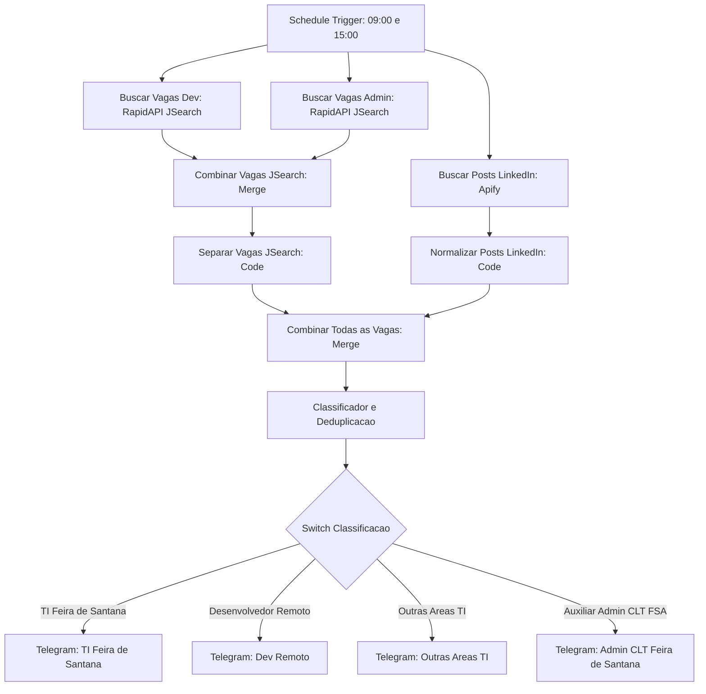

# Monitor de Vagas n8n

Sistema automatizado desenvolvido no n8n para monitoramento e classificacao de vagas de emprego em tempo real, com notificacoes via Telegram e organizacao por categorias profissionais.

## Arquitetura



## Categorias e Regras de Negocio

1. TI Feira de Santana: Vagas locais presenciais ou hibridas na area de tecnologia em Feira de Santana, Bahia.
2. Desenvolvedor Remoto: Vagas de estagio em desenvolvimento de software em modalidade remota para todo o Brasil.
3. Outras Areas TI: Vagas remotas em suporte, dados, qualidade e infraestrutura.
4. Auxiliar Administrativo CLT: Vagas exclusivamente presenciais em Feira de Santana com contratacao formal CLT. Vagas remotas, MEI ou PJ sao descartadas automaticamente.

## Recursos Tecnicos

- Multiplas fontes: integracao oficial de vagas de emprego (RapidAPI JSearch) combinada com raspagem de posts informais de recrutadores no feed do LinkedIn (Apify).
- Execucao automatica programada para 09:00 e 15:00 BRT.
- Filtro de idade de vagas: descarta automaticamente qualquer oportunidade publicada ha mais de 7 dias para evitar candidaturas em processos seletivos antigos.
- Exibicao de data formatada e indicador de recuo temporal nas mensagens do Telegram.
- Deduplicacao persistente em memoria (`seenJobIds`) para impedir o reenvio de vagas ja notificadas.
- Roteamento por no Switch para direcionar cada vaga para sua mensagem correspondente.
- Mensagens estruturadas no Telegram com bloco de codigo para copia direta de prompts voltados a IA.
- Auto-limpeza (auto-pruning) para manutencao sustentavel no plano gratuito Always Free da Oracle Cloud.
- Tolerancia a falhas configurada para execucao continua sem interrupcoes.

## Tecnologias

- n8n (hospedado na Oracle Cloud Always Free)
- JavaScript ES6
- JSearch API via RapidAPI
- Apify API (Scraper de posts do LinkedIn)
- Telegram Bot API
- Docker e Docker Compose

## Execucao Local

### 1. Clonar o repositorio
```bash
git clone https://github.com/Jntgirardi/monitor-de-vagas-n8n.git
cd monitor-de-vagas-n8n
```

### 2. Iniciar o n8n
Com Docker Compose:
```bash
docker compose up -d
```

Ou com Node.js:
```bash
npx n8n
```

Acesso local disponivel em: http://localhost:5678

### 3. Importar o Fluxo
1. No menu do n8n, selecione Add Workflow e clique em Import from File.
2. Escolha o arquivo workflows/monitor_de_vagas.json.
3. Configure as credenciais da RapidAPI, Apify e do Telegram.
4. Ative o fluxo pelo botao Publish.

Autor: Jonathas Girardi
Repositorio: https://github.com/Jntgirardi/monitor-de-vagas-n8n
