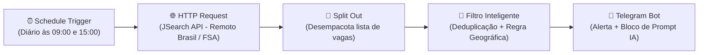

# 🚀 Monitor de Vagas n8n

Automação inteligente e escalável construída no **n8n** para monitorar oportunidades de **estágio em desenvolvimento e TI**, priorizando **vagas remotas em todo o Brasil** e vagas **presenciais exclusivas em Feira de Santana - BA**, com envio de alertas automáticos no **Telegram**, filtro de duplicadas e caixas de texto com recurso *one-click copy* para análise via IA.

---

## 📌 Arquitetura do Fluxo



---

## ✨ Funcionalidades Principais

- ⏱️ **Monitoramento Bi-diário:** Execução automática duas vezes ao dia (às **09:00** e às **15:00**).
- 📍 **Filtro Geográfico Inteligente:**
  - ✅ **Remoto:** Aceita vagas de estágio de qualquer lugar do Brasil.
  - 🏢 **Presencial / Híbrido:** Aceita **apenas** vagas localizadas em **Feira de Santana - BA** (descarta automaticamente vagas presenciais de outros estados/cidades).
- 🛡️ **Deduplicação em Memória:** Sistema de persistência em memória (`staticData`) para evitar repetição de vagas já notificadas.
- 💬 **Notificação Estruturada no Telegram:** Informações completas de cargo, empresa, modalidade e link direto.
- 📋 **Prompt Pronto para IA (One-Click Copy):** Bloco copiável com um único clique com o prompt formatado para enviar ao seu assistente de IA.

---

## 🛠️ Tecnologias Utilizadas

- **[n8n](https://n8n.io/)**: Orquestrador de fluxos e automações low-code
- **JavaScript (ES6+)**: Lógica customizada de filtro geográfico e controle de estado
- **RapidAPI (JSearch API)**: Agregador de vagas em tempo real (LinkedIn, Indeed, Glassdoor)
- **Telegram Bot API**: Entrega de notificações push no celular e desktop
- **Docker & Docker Compose**: Gerenciamento de containers e ambiente local reproduzível

---

## ⚙️ Como Executar o Projeto

### 1. Clonar o repositório
```bash
git clone https://github.com/Jntgirardi/monitor-de-vagas-n8n.git
cd monitor-de-vagas-n8n
```

### 2. Subir o n8n
Via Docker Compose:
```bash
docker compose up -d
```
Ou diretamente com Node.js:
```bash
npx n8n
```
Acesse o painel em: `http://localhost:5678`

### 3. Importar o Fluxo
1. No menu do n8n, clique em **Add Workflow** > **Import from File...**
2. Selecione o arquivo [`workflows/linkedin_job_monitor.json`](./workflows/linkedin_job_monitor.json).
3. Configure suas credenciais (RapidAPI Key e Token do Telegram).
4. Ative o workflow no botão **Publish**!

---

Desenvolvido por [Jonathas Girardi](https://github.com/Jntgirardi).
