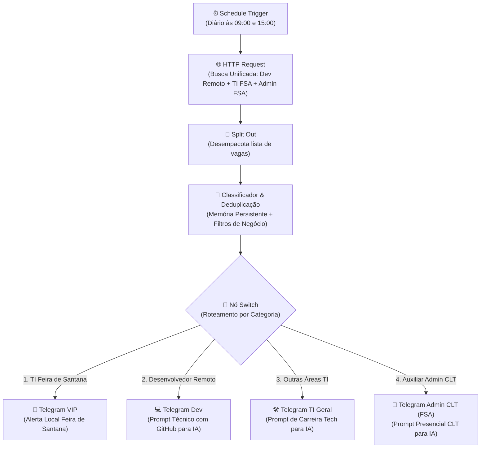

# 🚀 Monitor de Vagas n8n (Roteamento Inteligente com Switch)

Automação inteligente e escalável construída no **n8n** com **nó Switch e 4 ramificações especializadas** para monitorar oportunidades de emprego em tempo real, aplicando regras contratuais, geográficas e de carreira personalizadas:

1. 🚨 **Ramo 1 (VIP Local FSA):** Oportunidades presenciais ou híbridas de TI e tecnologia localizadas em **Feira de Santana - BA**.
2. 💻 **Ramo 2 (Dev Remoto):** Vagas de estágio em desenvolvimento de software (Frontend, Backend, Fullstack, Web) 100% remotas no Brasil todo.
3. 🛠️ **Ramo 3 (Outras Áreas TI):** Vagas remotas em áreas de suporte, testes/QA, infraestrutura e dados.
4. 🏢 **Ramo 4 (Auxiliar Administrativo CLT):** Vagas presenciais exclusivas de **Auxiliar Administrativo em Feira de Santana - BA** (100% presencial, contratação direta CLT/estágio, com exclusão de vagas MEI/PJ).

---

## 📌 Arquitetura do Fluxo



---

## ✨ Funcionalidades Principais

- ⏱️ **Monitoramento Bi-diário:** Execução automática duas vezes ao dia (às **09:00** e às **15:00**).
- 🔀 **Roteamento Inteligente via Switch (4 Saídas):** Cada vaga é analisada e direcionada para a saída e notificação corretas.
- 🏢 **Regra Rigorosa para Auxiliar Administrativo:**
  - 📍 **Exclusivo Feira de Santana - BA:** Validação territorial estrita.
  - 🏢 **100% Presencial:** Descarte automático de anúncios online/remotos/híbridos.
  - 🚫 **Sem ME / Sem PJ:** Elimina contratações via MEI, PJ ou prestador autônomo (foco total em contratação CLT ou estágio direto).
- 🛡️ **Deduplicação em Memória:** Armazena os IDs notificados em memória permanente (`staticData`) para impedir alertas repetidos.
- 📋 **Prompts Customizados por Trilha (One-Click Copy):** Cada uma das 4 categorias possui um prompt adaptado para você copiar com 1 toque e enviar para a IA te orientar na candidatura.

---

## 🛠️ Tecnologias Utilizadas

- **[n8n](https://n8n.io/)**: Orquestrador de fluxos e automações low-code
- **Switch Node & Code Node (JavaScript)**: Roteamento condicional e filtragem de regras de negócio
- **RapidAPI (JSearch API)**: Agregador de dados em tempo real (LinkedIn, Indeed, Glassdoor)
- **Telegram Bot API**: Notificações push categorizadas com blocos copiáveis
- **Docker & Docker Compose**: Ambiente de produção reproduzível

---

## ⚙️ Como Executar o Projeto

### 1. Clonar o repositório
```bash
git clone https://github.com/Jntgirardi/monitor-de-vagas-n8n.git
cd monitor-de-vagas-n8n
```

### 2. Subir o n8n
Via Docker Compose:
```bash
docker compose up -d
```
Ou diretamente com Node.js:
```bash
npx n8n
```
Acesse o painel em: `http://localhost:5678`

### 3. Importar o Fluxo
1. No menu do n8n, clique em **Add Workflow** > **Import from File...**
2. Selecione o arquivo [`workflows/linkedin_job_monitor.json`](./workflows/linkedin_job_monitor.json).
3. Configure suas credenciais (RapidAPI Key e Token do Telegram).
4. Ative o workflow no botão **Publish**!

---

Desenvolvido por [Jonathas Girardi](https://github.com/Jntgirardi).
