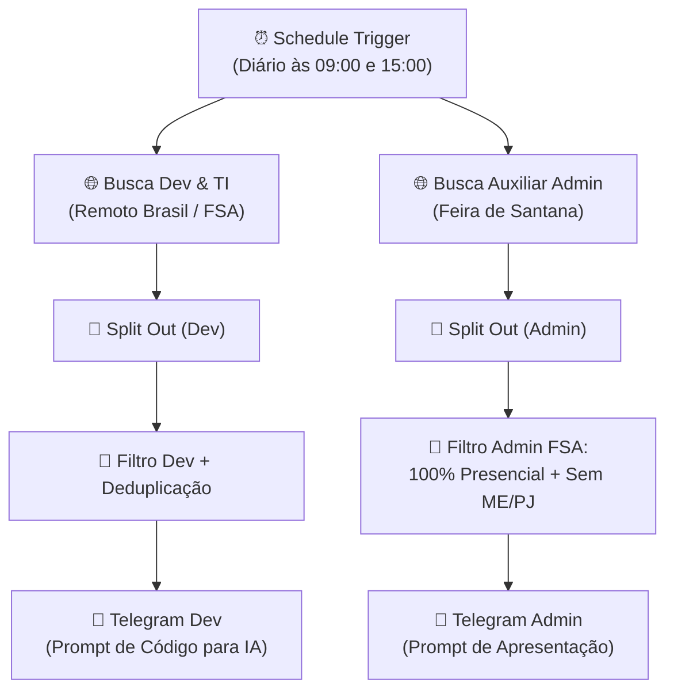

# 🚀 Monitor de Vagas n8n (Dual-Pipeline)

Automação inteligente e escalável construída no **n8n** com **arquitetura de esteira dupla (Dual-Pipeline)** para monitorar simultaneamente duas trilhas de carreira:
1. 💻 **Trilha TI & Desenvolvimento:** Estágios remotos em todo o Brasil ou locais em Feira de Santana - BA.
2. 🏢 **Trilha Administrativa Local:** Vagas presenciais exclusivas de **Auxiliar Administrativo em Feira de Santana - BA** (com filtro de descarte para vagas online/home office e sem contratação PJ/MEI).

---

## 📌 Arquitetura do Fluxo (Dual-Pipeline)



---

## ✨ Funcionalidades Principais

- ⏱️ **Monitoramento Bi-diário:** Execução automática duas vezes ao dia (às **09:00** e às **15:00**).
- 🔀 **Esteira Dupla de Execução (Dual-Pipeline):** Processamento em paralelo de dois nichos profissionais distintos.
- 💻 **Trilha Tecnologia:**
  - Vagas de estágio remoto no Brasil inteiro ou presenciais em Feira de Santana.
  - Alerta formatado com prompt focado em análise técnica para IA.
- 🏢 **Trilha Administrativa (Regras Rigorosas):**
  - ✅ **100% Presencial:** Descarte automático de vagas remotas/online/híbridas.
  - 📍 **Exclusivo Feira de Santana - BA:** Validação geográfica estrita.
  - 🚫 **Sem ME / Sem PJ:** Filtro que descarta vagas de contratação MEI, Pessoa Jurídica, comissionados ou prestadores autônomos (foco em contratação CLT ou estágio direto).
- 🛡️ **Deduplicação Inteligente em Memória:** Armazena os IDs notificados separadamente por trilha para evitar mensagens repetidas.
- 📋 **Prompt Pronto para IA (One-Click Copy):** Bloco de código para copiar os requisitos e prompt com um único toque.

---

## 🛠️ Tecnologias Utilizadas

- **[n8n](https://n8n.io/)**: Orquestrador de fluxos e automações low-code
- **JavaScript (ES6+)**: Lógica customizada de filtros geográficos, contratuais e deduplicação
- **RapidAPI (JSearch API)**: Agregador de dados em tempo real (LinkedIn, Indeed, Glassdoor)
- **Telegram Bot API**: Notificações push categorizadas com blocos copiáveis
- **Docker & Docker Compose**: Ambiente de produção reproduzível

---

## ⚙️ Como Executar o Projeto

### 1. Clonar o repositório
```bash
git clone https://github.com/Jntgirardi/monitor-de-vagas-n8n.git
cd monitor-de-vagas-n8n
```

### 2. Subir o n8n
Via Docker Compose:
```bash
docker compose up -d
```
Ou diretamente com Node.js:
```bash
npx n8n
```
Acesse o painel em: `http://localhost:5678`

### 3. Importar o Fluxo
1. No menu do n8n, clique em **Add Workflow** > **Import from File...**
2. Selecione o arquivo [`workflows/linkedin_job_monitor.json`](./workflows/linkedin_job_monitor.json).
3. Configure suas credenciais (RapidAPI Key e Token do Telegram).
4. Ative o workflow no botão **Publish**!

---

Desenvolvido por [Jonathas Girardi](https://github.com/Jntgirardi).
